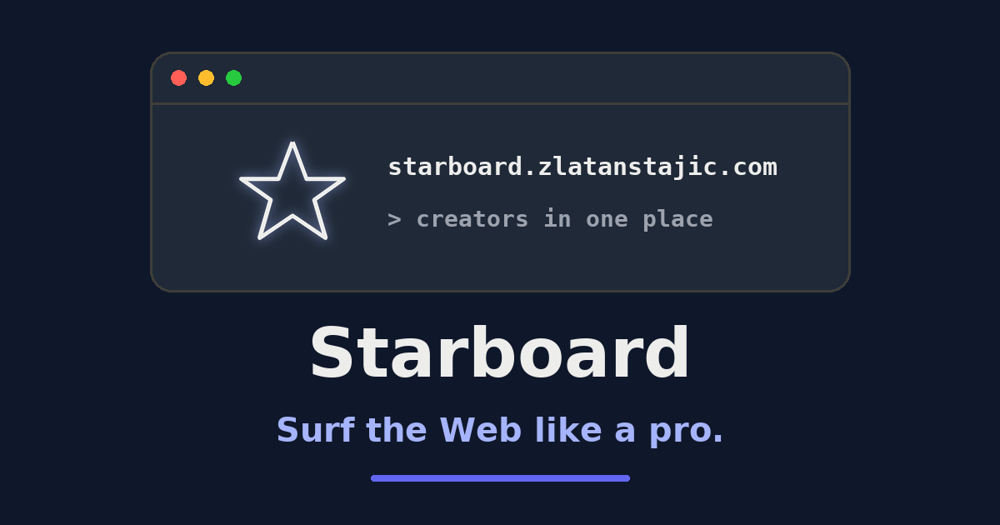

# Starboard

[](https://github.com/zlatanstajic/starboard/actions/workflows/tests.yml)
[](LICENSE.md)
[](https://github.com/zlatanstajic/starboard/actions)
[](https://www.php.net/)
[](https://laravel.com/)

> Surf the Web like a pro.

A centralized Laravel application for tracking and organizing favorite creators across multiple social networks. Starboard keeps profiles, visits, favorites, tags, and shareable filtered lists in one place.



## Table of Contents

- [Features](#features)
- [Tech Stack](#tech-stack)
- [Install](#install)
  - [Requirements](#requirements)
  - [Local Setup](#local-setup)
- [Docker](#docker)
  - [Quick Start](#quick-start)
  - [Environment Variables](#environment-variables)
  - [Common Commands](#common-commands)
- [Testing](#testing)
- [Continuous Integration](#continuous-integration)
  - [Pre-commit Hook](#pre-commit-hook)
- [Contributing](#contributing)
- [License](#license)

---

## Features

- **Multi-network profiles:** Track creators across Instagram, TikTok, X/Twitter, YouTube, and other sources.
- **Visit tracking:** Record profile visits and sort or filter by visit count and recency.
- **Favorites and tags:** Keep important profiles close and organize them with reusable tags.
- **Advanced filtering:** Filter by source, status, favorites, visit data, and other profile attributes.
- **Shareable filter lists:** Publish a named dashboard filter set at a revocable public URL.
- **Public discovery:** Showcase the ten most recently published filter lists on the landing page.
- **YouTube fetching:** Fetch and track new channel items with request budgeting, retries, and queued jobs.
- **Customizable columns:** Choose which dashboard columns are visible and retain the selection in the browser.
- **Responsive interface:** Use the application across desktop and mobile layouts, including dark mode.
- **Localized interface:** Switch between English and Serbian.

[⬆ back to top](#table-of-contents)

---

## Tech Stack

- **Backend:** PHP 8.5 and Laravel 13
- **Frontend:** Blade, Alpine.js, Tailwind CSS, and Vite
- **Database:** MySQL 8.4 in Docker; SQLite is used by CI
- **Testing:** PHPUnit with a required minimum coverage of 85%
- **Quality:** Rector, Peck, Laravel Pint, and PHPStan/Larastan

[⬆ back to top](#table-of-contents)

---

## Install

### Requirements

- PHP 8.5 with the extensions required by [`composer.json`](composer.json)
- Composer 2
- Node.js 22 or newer with npm
- MySQL or MariaDB

Docker users only need Docker 24+ and Docker Compose v2+; see [Docker](#docker).

### Local Setup

Clone the repository and create local environment files:

```bash
git clone https://github.com/zlatanstajic/starboard.git
cd starboard
cp .env.example .env
cp .env.example .env.testing
```

Configure the database and any optional integrations in `.env`, then run:

```bash
composer setup
```

The setup script installs PHP and Node.js dependencies, generates the application key, recreates and seeds the database, builds frontend assets, and runs the complete quality suite. Because it runs `migrate:fresh`, it deletes existing data in the configured development database.

Start the local application, queue listener, log viewer, and Vite development server with:

```bash
composer run serve
```

The application is available at `http://localhost:8000` by default.

[⬆ back to top](#table-of-contents)

---

## Docker

The production-oriented Docker setup uses a multi-stage [`Dockerfile`](Dockerfile) and three services in [`docker-compose.yml`](docker-compose.yml): `app` (PHP-FPM), `nginx`, and `mysql`.

### Quick Start

```bash
# Create and configure the local environment
cp .env.example .env

# Build the image and start all services
docker compose up -d --build

# Seed the database on first run
docker compose exec app php artisan db:seed
```

The application is available at `http://localhost:18000`. The container entrypoint generates a missing `APP_KEY` and runs database migrations whenever the application container starts.

### Environment Variables

Override these values in `.env` before starting the services:

| Variable | Default | Description |
|---|---|---|
| `APP_KEY` | Generated when missing | Laravel application key |
| `APP_PORT` | `18000` | Host port mapped to nginx |
| `DB_DATABASE` | `starboard` | MySQL database name |
| `DB_USERNAME` | `starboard` | MySQL user |
| `DB_PASSWORD` | `secret` | MySQL user password |
| `DB_ROOT_PASSWORD` | `rootsecret` | MySQL root password |

MySQL is exposed on host port `13306` and uses port `3306` inside the Docker network. Additional application and YouTube fetch settings are documented in [`.env.example`](.env.example) and [`docs/YOUTUBE_FETCH_RUNBOOK.md`](docs/YOUTUBE_FETCH_RUNBOOK.md).

### Common Commands

```bash
# Check service status
docker compose ps

# Stream application logs
docker compose logs -f app

# Run an Artisan command
docker compose exec app php artisan <command>

# Open a shell in the application container
docker compose exec app bash

# Rebuild after Docker or dependency changes
docker compose up -d --build

# Stop services
docker compose down
```

The runtime image contains production dependencies only. Run Composer and the complete development quality suite through the [local setup](#local-setup), not inside the production container.

[⬆ back to top](#table-of-contents)

---

## Testing

Run the complete quality suite:

```bash
composer run test
```

This checks Rector, Peck, Pint, PHPStan, and PHPUnit. PHPUnit enforces at least 85% coverage and requires a configured `.env.testing` file.

During development, run the smallest relevant PHPUnit test first:

```bash
php artisan test --compact tests/Feature/ExampleTest.php

# Or filter by test method name
php artisan test --compact --filter=test_name
```

[⬆ back to top](#table-of-contents)

---

## Continuous Integration

Pushes to `master` and branches matching `issues/*` run the complete quality suite with PHP 8.5 and Node.js 24 through [`.github/workflows/tests.yml`](.github/workflows/tests.yml). Branch names are kebab-case, for example `issues/12-short-description`; any other branch name gets no CI run.

### Pre-commit Hook

The repository includes a Husky hook at [`.husky/pre-commit`](.husky/pre-commit) that runs `composer run test` before each commit. It is installed by npm's `prepare` script when dependencies are installed. To install or refresh it explicitly, run:

```bash
npm run prepare
```

A failing check aborts the commit. Run `composer run test` directly to reproduce the failure. Bypass the hook for a single commit only when necessary with:

```bash
git commit --no-verify
```

[⬆ back to top](#table-of-contents)

---

## Contributing

Contributions are welcome. See [CONTRIBUTING.md](CONTRIBUTING.md) for how to propose a change.

[⬆ back to top](#table-of-contents)

---

## License

This project is licensed under the MIT License. See the [LICENSE](LICENSE.md) file for details.

[⬆ back to top](#table-of-contents)
